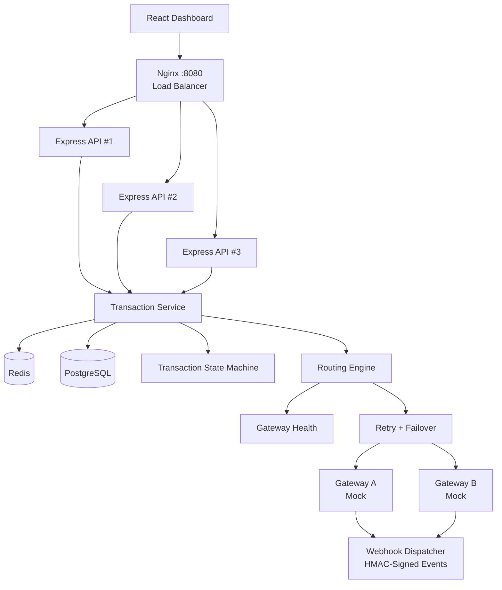
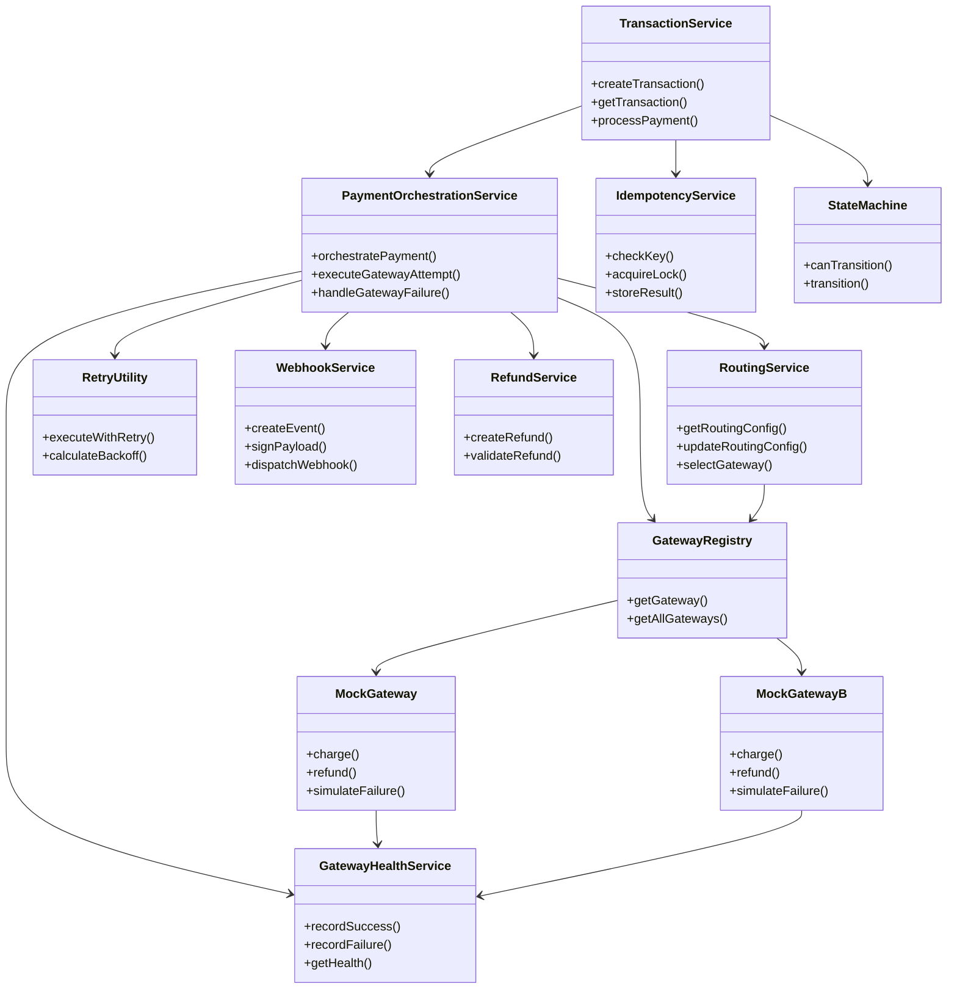
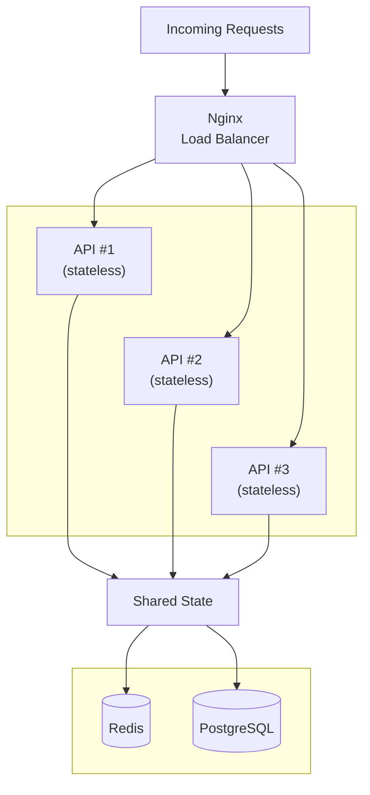
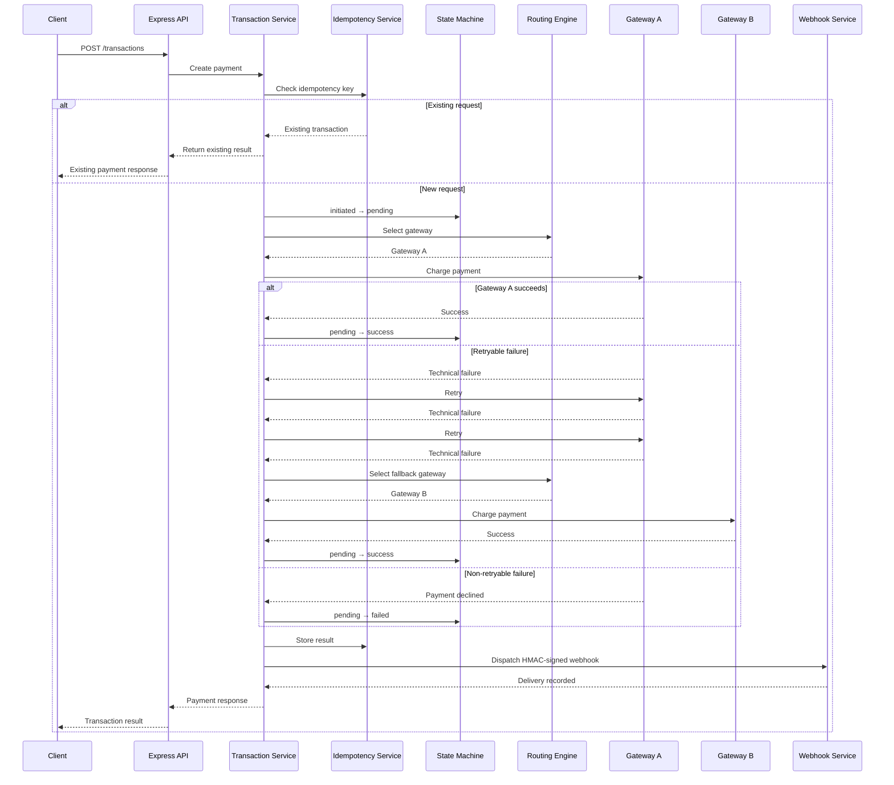
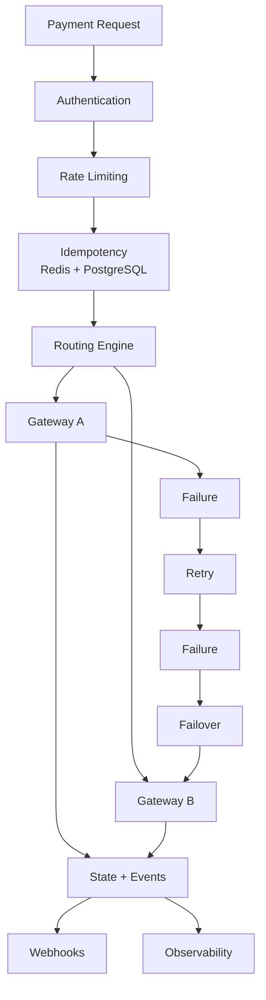

# PayFlux — Payment Orchestration & Transaction Processing Platform

> A fault-tolerant payment orchestration platform built to demonstrate backend engineering concepts used in modern payment systems: **idempotency, guarded state machines, multi-gateway routing, retries, automatic failover, webhook security, partial refunds, horizontal scaling, load balancing, distributed consistency, and observability.**

PayFlux sits between a merchant application and payment providers, providing a unified transaction layer that can **route payments, retry transient failures, fail over between gateways, and maintain a consistent transaction state across multiple API instances.**

---

# 🚀 What PayFlux Demonstrates

* **Idempotent payment processing** using Redis + PostgreSQL
* **Guarded transaction state machine**
* **Multi-gateway abstraction** with two mock payment providers
* **Backend-driven payment routing**
* **Automatic retry with exponential backoff**
* **Automatic gateway failover**
* **Gateway health monitoring**
* **HMAC-signed webhook delivery**
* **Full and partial refunds**
* **Horizontal scaling** with three stateless API instances
* **Load balancing** using Nginx
* **Distributed consistency** using Redis + PostgreSQL
* **Redis-backed rate limiting**
* **Structured transaction/audit events**
* **Integration and concurrency testing**
* **React dashboard for payments and system observability**

---

# 🏗️ Architecture



See `backend/migrations/*.sql` for the data model and `backend/src/services/stateMachine.js` for the transaction lifecycle.

---


---

# 🧩 System Design Concepts

## Horizontal Scaling

PayFlux uses a horizontally scaled API architecture with **three Express API instances behind an Nginx load balancer**.



Instead of scaling a single API server vertically, additional API instances can be added to handle increased request volume.

The API instances are designed to remain stateless so that any instance can safely process a request.

---

## Load Balancing

Nginx acts as the entry point for API traffic and distributes requests across the three Express instances.

```text
Client
  │
  ▼
Nginx
  ├──→ API #1
  ├──→ API #2
  └──→ API #3
```

This prevents all traffic from depending on a single application instance and allows the API layer to scale horizontally.

---

## Stateless API Design

Critical application state is not stored in individual API processes.

Shared state is maintained through:

### Redis

Used for:

* idempotency locks/cache
* rate limiting
* shared routing state

### PostgreSQL

Used for:

* transactions
* transaction events
* gateway attempts
* webhook logs
* routing configuration
* durable idempotency constraints

This means API #1, API #2 and API #3 can independently process requests without maintaining separate application state.

---

## Distributed Consistency

Because requests can reach different API instances:

```text
Request 1 → API #1
Request 2 → API #3
Request 3 → API #2
```

the system cannot rely on process-local memory for important state.

For example, routing configuration and round-robin state are stored in shared Redis/PostgreSQL storage.

This ensures that the behavior of the platform remains consistent regardless of which API instance receives the request.

---

## Failure Isolation

Failure is handled at multiple layers.

### API Layer

If one API instance becomes unavailable, Nginx can continue routing traffic to the remaining instances.

### Gateway Layer

If a payment gateway experiences transient failures:

```text
Gateway A
    ↓
Retry
    ↓
Retry
    ↓
Failover
    ↓
Gateway B
```

This prevents a single gateway failure from necessarily becoming a complete payment failure.

---

## Scalability Model

The architecture can scale the API layer independently:

```text
Current:

Nginx
 ├── API #1
 ├── API #2
 └── API #3


Higher traffic:

Nginx
 ├── API #1
 ├── API #2
 ├── API #3
 ├── API #4
 ├── API #5
 └── ...
```

The payment business logic remains independent of the number of API instances.

---

# 💳 Payment Flow

A normal transaction follows:



For a transient gateway failure:

```text
Gateway A
   ↓
Failure
   ↓
Retry #1
   ↓
Failure
   ↓
Retry #2
   ↓
Failure
   ↓
Automatic Failover
   ↓
Gateway B
   ↓
Success
```

Every important step is recorded in the transaction event history.

---

# 🔑 Core Features

## 1. Idempotency

PayFlux uses a **dual-layer idempotency mechanism**:

```text
Request
   ↓
Redis lock/cache
   ↓
PostgreSQL UNIQUE constraint
   ↓
Single transaction
```

A unique constraint on:

```text
(merchant_id, idempotency_key)
```

acts as the durable database-level backstop.

This protects against duplicate payments caused by:

* client retries
* network timeouts
* concurrent requests
* multiple API instances

The concurrency test fires **10 identical requests** and verifies that only one transaction is created.

---

## 2. Guarded Payment State Machine

Transactions cannot arbitrarily change state.

```text
initiated
    ↓
 pending
   ↙   ↘
success failed
   ↓
partially_refunded
   ↓
 refunded
```

Illegal transitions are rejected instead of silently modifying the transaction.

This keeps payment state transitions explicit and auditable.

---

## 3. Multi-Gateway Abstraction

Two mock gateways implement the same `charge()` interface:

```text
PaymentGateway
      │
 ┌────┴────┐
 ▼         ▼
Gateway A  Gateway B
```

The orchestration layer does not need gateway-specific business logic.

Each gateway can simulate:

* success
* failure
* latency
* retryable errors
* non-retryable errors
* forced failures for demonstrations

No real payment provider credentials are required.

---

## 4. Routing Engine

The routing engine supports three backend-driven strategies.

### Round Robin

```text
A → B → A → B → A → B
```

### Weighted

```text
Gateway A → 70%
Gateway B → 30%
```

### Health Based

The routing engine prefers gateways with healthier operational metrics.

Routing configuration can be changed from the dashboard.

---

## 5. Retry & Automatic Failover

Transient technical failures are retried using **exponential backoff**.

```text
Attempt 1
   ↓
100ms
   ↓
Attempt 2
   ↓
200ms
   ↓
Attempt 3
   ↓
400ms
   ↓
Failover
```

Retryable technical failures can trigger failover.

Business-level payment declines do not automatically trigger failover.

Example:

```text
Gateway A
  ├── Attempt 1 → TIMEOUT
  ├── Retry 1 → TIMEOUT
  └── Retry 2 → TIMEOUT
                  ↓
             FAILOVER
                  ↓
             Gateway B
                  ↓
               SUCCESS
```

The transaction remains a **single database transaction record** throughout the orchestration process.

---

## 6. Gateway Health

Health metrics are calculated from PostgreSQL and shared across all API instances.

Tracked per gateway:

* request count
* successful requests
* failed requests
* success rate
* failure rate
* latency
* retry count
* failover count
* current health status

The health information feeds both:

* System Health dashboard
* Health-based routing

---

## 7. Partial Refunds

Refunds support both full and partial amounts.

Example:

```text
Original payment       ₹2,000
First refund             ₹500
Remaining refundable   ₹1,500
```

Multiple partial refunds are supported:

```text
₹2,000 payment

Refund ₹500
Remaining → ₹1,500

Refund ₹1,000
Remaining → ₹500

Refund ₹600
→ Rejected
```

Over-refunding is prevented.

Amounts are stored as integer values in the smallest currency unit rather than floating-point values.

---

## 8. Webhooks

PayFlux provides:

* HMAC-signed webhook payloads
* signature verification
* delivery retries
* webhook delivery logging
* simulated merchant receiver

This allows webhook processing to be tested without requiring external tunnelling or real payment providers.

---

## 9. Transaction Audit Trail

Every important transaction event is persisted in `transaction_events`.

Examples:

```text
payment_initiated
gateway_selected
gateway_request
gateway_failed
retry_attempt
failover_triggered
gateway_switched
payment_success
```

This powers the per-transaction orchestration timeline.

---

# 📊 Dashboard

The React dashboard provides:

### Transactions

* transaction list
* filtering
* transaction state
* gateway used

### Transaction Details

* transaction information
* orchestration timeline
* gateway attempts
* retries
* failovers
* webhook events
* refund information

### Analytics

* payment volume
* success/failure metrics
* gateway performance
* retry/failover statistics

### Routing

* routing strategy
* gateway weights
* gateway health
* demo failure controls

### System Health

* Nginx
* Redis
* PostgreSQL
* API instances
* Gateway A
* Gateway B

---

# 🧠 Key Engineering Decisions

## Why PostgreSQL?

Payment transactions and their associated events have strong relational relationships.

PostgreSQL provides:

* transactions
* foreign keys
* unique constraints
* durable state
* reliable money-related persistence

The database-level uniqueness constraint provides a hard guarantee against duplicate idempotency keys.

---

## Why Redis + PostgreSQL for Idempotency?

Redis provides a fast distributed lock/cache layer.

PostgreSQL provides the durable correctness guarantee.

```text
Redis
  ↓
Fast duplicate detection / locking

PostgreSQL
  ↓
Durable uniqueness constraint
```

Using only application memory would fail when requests are distributed across multiple API instances.

---

## Why Store Money as BIGINT?

Amounts are stored in the smallest currency unit.

Example:

```text
₹50.00 → 5000 paise
```

This avoids floating-point precision problems, especially when applying multiple partial refunds.

---

## Why Store Events Separately?

Transaction history is stored in the `transaction_events` table rather than as an opaque JSON history field.

This provides:

* queryable events
* complete audit history
* gateway attempt tracking
* failover visibility
* transaction-level observability

---

## Why Shared Routing State?

The application runs three API instances.

If routing state existed only in memory, each instance could have a different view of routing state.

Persisting shared routing state in Redis/PostgreSQL keeps routing behavior consistent regardless of which instance receives the request.

---

# 🧪 Failure Demonstration

The most important project demonstration is automatic gateway failover.

Run:

```bash
cd backend
chmod +x demo-failover.sh
./demo-failover.sh
```

The demo:

1. Forces Gateway A to fail.
2. Pins routing to Gateway A.
3. Creates a payment.
4. Gateway A fails.
5. Retries are attempted.
6. Gateway A continues failing.
7. Failover switches to Gateway B.
8. Gateway B succeeds.
9. The complete orchestration timeline is displayed from `transaction_events`.

The same scenario can also be demonstrated from the dashboard using the Routing page's demo controls.

---

# 🔐 Idempotency Demonstration

Run:

```bash
cd backend
chmod +x demo-idempotency.sh
./demo-idempotency.sh
```

The script sends 10 concurrent requests with the same idempotency key.

Expected result:

```text
10 requests
     ↓
1 transaction
     ↓
same transaction result returned
```

---

# 🧪 Testing

Backend tests can be run with:

```bash
cd backend
npm test
```

The test suite covers:

| Test                                | Coverage                                        |
| ----------------------------------- | ----------------------------------------------- |
| `stateMachine.test.js`              | Guarded payment state transitions               |
| `partialRefundStateMachine.test.js` | Partial refund state transitions                |
| `idempotency.test.js`               | Concurrent duplicate request protection         |
| `routing.test.js`                   | Round robin, weighted routing and validation    |
| `failover.test.js`                  | Retry, failover and idempotency preservation    |
| `partialRefund.test.js`             | Partial/full refunds and over-refund protection |

The critical integration scenario is:

```text
Gateway A failure
      ↓
Retries
      ↓
Gateway A still fails
      ↓
Failover
      ↓
Gateway B
      ↓
Success
```

---

# 🔌 API Reference

| Method | Endpoint                                     | Description                              |
| ------ | -------------------------------------------- | ---------------------------------------- |
| `POST` | `/transactions`                              | Create an idempotent transaction         |
| `GET`  | `/transactions`                              | List/filter transactions                 |
| `GET`  | `/transactions/:id`                          | Get transaction state                    |
| `GET`  | `/transactions/:id/events`                   | Get complete audit/orchestration history |
| `GET`  | `/transactions/:id/webhooks`                 | Get webhook delivery history             |
| `POST` | `/transactions/:id/refund`                   | Full or partial refund                   |
| `GET`  | `/routing/config`                            | Get routing configuration                |
| `PUT`  | `/routing/config`                            | Update routing strategy/weights          |
| `GET`  | `/routing/health`                            | Get per-gateway health                   |
| `POST` | `/routing/simulate/:gatewayId/force-failure` | Force gateway failure for demos          |
| `POST` | `/mock-merchant/webhook`                     | Simulated merchant webhook receiver      |

Authenticated API requests require:

```text
X-API-Key
```

Payment creation requires:

```text
Idempotency-Key
```

---

# 🛠️ Tech Stack

### Backend

* Node.js
* Express
* PostgreSQL
* Redis
* REST APIs

### Frontend

* React
* React Router

### Infrastructure

* Docker
* Docker Compose
* Nginx

### Testing

* Jest

---

# 🚀 Local Setup

## Option A — Docker Compose

Recommended.

```bash
docker-compose up --build
```

This starts:

* PostgreSQL
* Redis
* 3 API instances
* Nginx
* Frontend

Run migrations:

```bash
docker-compose exec api1 npm run migrate
```

The API is available through Nginx at:

```text
http://localhost:8080
```

The frontend is exposed on the port configured in `docker-compose.yml`.

A development merchant is seeded with:

```text
API Key: dev_test_key_123
```

---

## Option B — Run Backend Locally

Start PostgreSQL and Redis first.

Then:

```bash
cd backend
cp .env.example .env
npm install
npm run migrate
npm run dev
```

Start the frontend:

```bash
cd frontend
npm install
npm run dev
```

The development frontend proxies `/api/*` requests to the backend.

---

# 📁 Project Structure

```text
Payment-Orchestration/
│
├── backend/
│   ├── migrations/
│   │   ├── 001_init.sql
│   │   ├── 002_gateway_routing.sql
│   │   ├── 003_partially_refunded_status.sql
│   │   └── 004_partial_refunds.sql
│   │
│   ├── src/
│   │   ├── config/
│   │   │   ├── db.js
│   │   │   └── redis.js
│   │   │
│   │   ├── services/
│   │   │   ├── stateMachine.js
│   │   │   ├── idempotencyService.js
│   │   │   ├── transactionService.js
│   │   │   ├── mockGateway.js
│   │   │   ├── mockGatewayB.js
│   │   │   ├── gatewayRegistry.js
│   │   │   ├── routingService.js
│   │   │   ├── gatewayHealthService.js
│   │   │   ├── paymentOrchestrationService.js
│   │   │   └── webhookService.js
│   │   │
│   │   ├── middleware/
│   │   │   ├── auth.js
│   │   │   └── rateLimiter.js
│   │   │
│   │   ├── routes/
│   │   │   ├── transactions.js
│   │   │   ├── routing.js
│   │   │   └── mockMerchant.js
│   │   │
│   │   ├── utils/
│   │   │   └── retry.js
│   │   │
│   │   └── __tests__/
│   │       ├── stateMachine.test.js
│   │       ├── partialRefundStateMachine.test.js
│   │       ├── idempotency.test.js
│   │       ├── routing.test.js
│   │       ├── failover.test.js
│   │       └── partialRefund.test.js
│   │
│   ├── demo-idempotency.sh
│   └── demo-failover.sh
│
├── frontend/
│   └── src/
│       ├── pages/
│       │   ├── TransactionList.jsx
│       │   ├── TransactionDetail.jsx
│       │   ├── Analytics.jsx
│       │   ├── WebhookLog.jsx
│       │   ├── IdempotencyDemo.jsx
│       │   ├── SystemHealth.jsx
│       │   └── Routing.jsx
│       ├── components/
│       ├── context/
│       └── api.js
│
├── docker-compose.yml
└── README.md
```

---

# 🎯 Design Goals

PayFlux intentionally focuses on **backend reliability, scalability and payment orchestration rather than integrating real payment providers**.

The central engineering problem is:

> **How do you reliably process a payment when requests can be duplicated, gateways can fail, requests can be retried, and multiple backend instances are processing traffic concurrently?**

PayFlux addresses this through:



---

# 📌 Future Improvements

Potential future extensions include:

* Circuit breaker for unhealthy gateways
* Asynchronous payment processing using a durable queue
* Distributed tracing
* OpenTelemetry metrics
* More advanced routing rules
* Gateway-specific timeout policies
* Dead-letter handling for failed webhook deliveries

These are intentionally kept outside the current implementation to keep the project focused on its core orchestration and reliability model.

---

# 👩‍💻 Project Focus

**PayFlux is primarily a backend engineering and distributed-systems project.**

The project demonstrates how a payment platform can combine:

**Horizontal Scaling + Load Balancing + Idempotency + State Management + Routing + Retry + Failover + Shared State + Event Logging + Observability**

to build a payment processing system that remains reliable even when requests are duplicated, API instances are distributed, or payment gateways experience failures.
